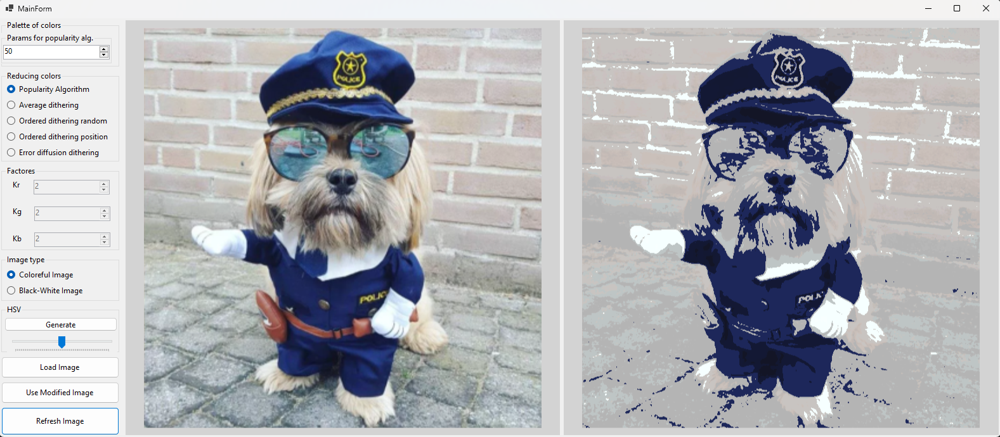

# GKLab3

This is my project made for the subject of computer graphics. It is a photo edtitng desktop application which uses such algorithms for color reduction like:

- Popularity algorithm
- Average dithering
- Ordered dithering random
- Ordered dithering position
- Error diffusion dithering

There is also able to change main factors `Fr, Fg, Fb` (dithering) or `palette of colors` (popularity alg).

The last feature is generating palette of HSV colors.

# Architecture

The project is an attempt of use model-view-presenter (MVP) architectural pattern.

# GUI - Windows Forms

